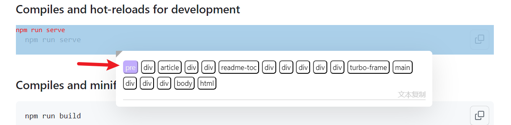
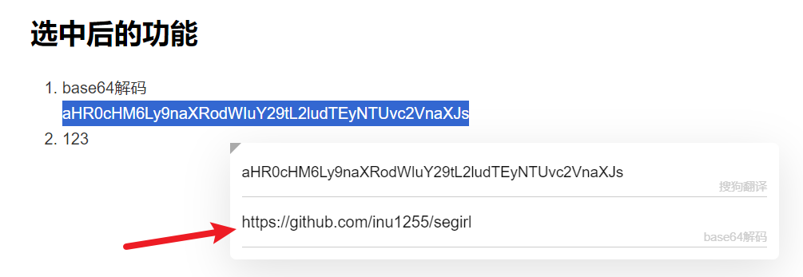
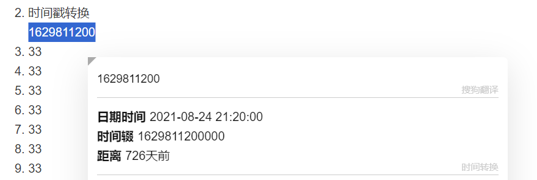
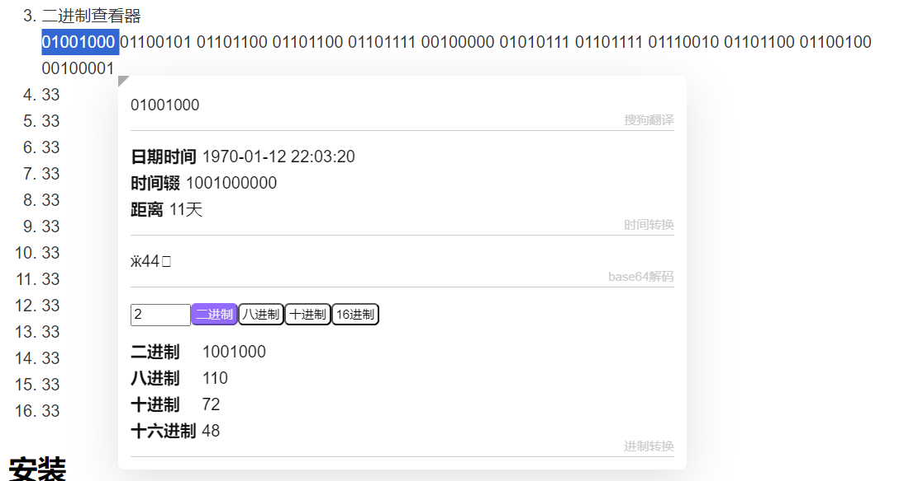
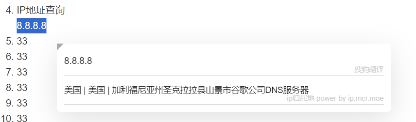
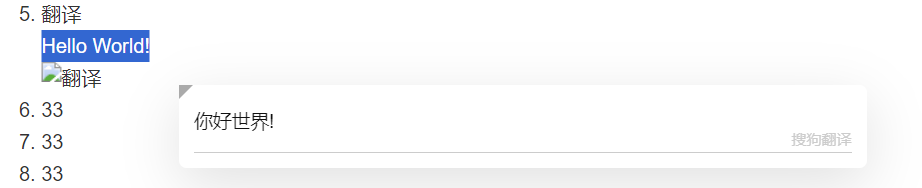

# 滑姬

滑姬是一个浏览器插件, 选中文字后会弹出滑姬图标, 点击滑姬图标可以执行翻译等操作。

## 超级复制

`Alt+右键` 超级复制面板

对于网页上想复制的内容，按住`Alt`再点击鼠标右键，就可以弹出超级复制面板。
超级复制面板会列出选中区域可复制的所有元素, 鼠标放上去会高亮显示, 点击即可复制。

## 选中后的功能

1. base64解码
   aHR0cHM6Ly9naXRodWIuY29tL2ludTEyNTUvc2VnaXJs
	 
2. 时间戳转换
	 1629811200
	 
3. 二进制查看器
	 01001000 01100101 01101100 01101100 01101111 00100000 01010111 01101111 01110010 01101100 01100100 00100001
	 
4. IP地址查询
   8.8.8.8
	 
5. 翻译
	 Hello World!
	 

